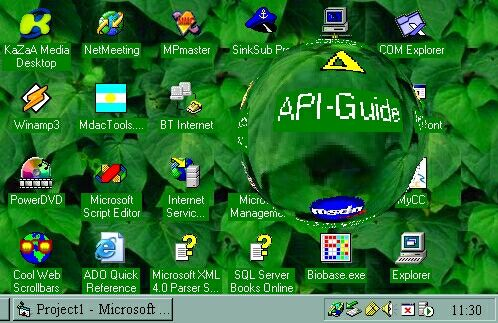

<div align="center">

## Desktop Lens


</div>

### Description

Display magnifying lens on your desktop.

This is a modification of Lens code originally submitted on: 9/7/2002 by Scythe. I hated his graphics so this version will run that nice lens effect over your desktop.

All credits to Schyte please!
 
### More Info
 


<span>             |<span>
---                |---
**Submitted On**   |1999-06-30 11:09:14
**By**             |[Vojimir Bato Kecman](https://github.com/Planet-Source-Code/PSCIndex/blob/master/ByAuthor/vojimir-bato-kecman.md)
**Level**          |Intermediate
**User Rating**    |4.3 (26 globes from 6 users)
**Compatibility**  |VB 5\.0, VB 6\.0
**Category**       |[Graphics](https://github.com/Planet-Source-Code/PSCIndex/blob/master/ByCategory/graphics__1-46.md)
**World**          |[Visual Basic](https://github.com/Planet-Source-Code/PSCIndex/blob/master/ByWorld/visual-basic.md)
**Archive File**   |[Desktop\_Le1306049132002\.zip](https://github.com/Planet-Source-Code/vojimir-bato-kecman-desktop-lens__1-38958/archive/master.zip)

### API Declarations

```
Private Declare Function GetDIBits Lib "gdi32" (ByVal aHDC As Long, ByVal hBitmap As Long, ByVal nStartScan As Long, ByVal nNumScans As Long, lpBits As Any, lpBI As BITMAPINFO, ByVal wUsage As Long) As Long
Private Declare Function SetDIBits Lib "gdi32" (ByVal hdc As Long, ByVal hBitmap As Long, ByVal nStartScan As Long, ByVal nNumScans As Long, lpBits As Any, lpBI As BITMAPINFO, ByVal wUsage As Long) As Long
Private Declare Function CreateDC Lib "gdi32" Alias "CreateDCA" (ByVal lpDriverName As String, ByVal lpDeviceName As String, ByVal lpOutput As String, ByVal lpInitData As Long) As Long
Private Declare Function CreateCompatibleDC Lib "gdi32" (ByVal hdc As Long) As Long
Private Declare Function CreateCompatibleBitmap Lib "gdi32" (ByVal hdc As Long, ByVal nWidth As Long, ByVal nHeight As Long) As Long
Private Declare Function DeleteDC Lib "gdi32" (ByVal hdc As Long) As Long
Private Declare Function GetDeviceCaps Lib "gdi32" (ByVal hdc As Long, ByVal nIndex As Long) As Long
Private Declare Function SelectObject Lib "gdi32" (ByVal hdc As Long, ByVal hObject As Long) As Long
Private Declare Function BitBlt Lib "gdi32" (ByVal hDestDC As Long, ByVal x As Long, ByVal y As Long, ByVal nWidth As Long, ByVal nHeight As Long, ByVal hSrcDC As Long, ByVal xSrc As Long, ByVal ySrc As Long, ByVal dwRop As Long) As Long
Private Declare Function DeleteObject Lib "gdi32" (ByVal hObject As Long) As Long
```


